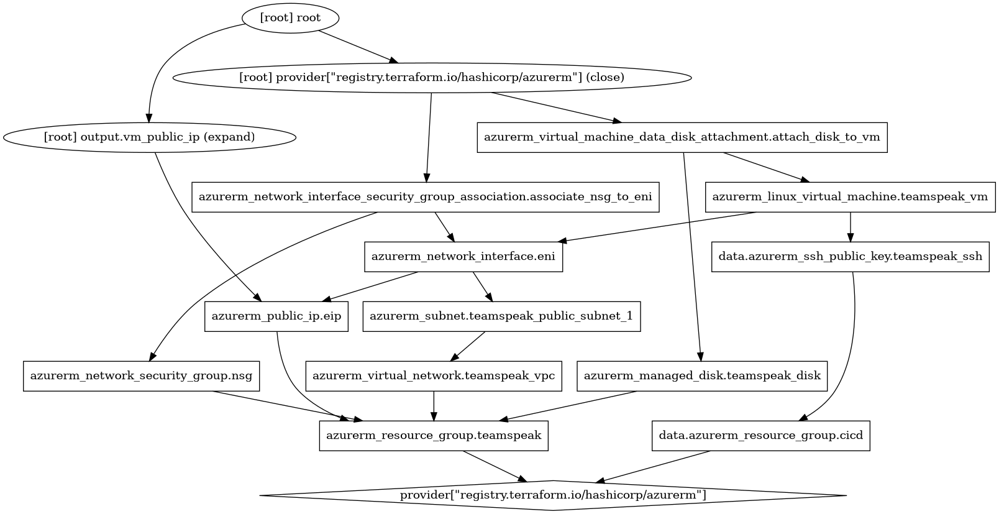

# Teamspeak 6 Server

This repository contains the infrastructure code to set up an Azure Virtual Machine that runs a Teamspeak 6 server.

## Usage (Azure)

1. Fork and clone this repository, then populate the following required secrets for GitHub Actions:
    - `AZURE_CLIENT_ID`
    - `AZURE_TENANT_ID`
    - `AZURE_SUBSCRIPTION_ID`
    - `TF_API_TOKEN`
    - The secrets above are required for authentication to both Terraform Cloud (for state management) and your Azure tenant.
2. In the `terraform/azure/init.tf` file, change the `azurerm` provider's `subscription_id` field to your target subscription's UUID where you want to launch the server infrastructure.
3. In the same file (`terraform/azure/init.tf`), point the `organization` field and `workspaces` name at your target Terraform Cloud workspace for state management. Because this repository runs the Terraform `plan` and `apply` workflows, consider disabling remote runs in TF Cloud. Alternatively, clear this block and instantiate your own backend if you prefer a different way to manage Terraform state.
4. Optionally, authenticate your local Terraform and Azure tooling to run `terraform plan` operations locally.
5. You are now ready to work off feature branches or push directly to the repository's `master` (default) or `main` branch as desired.

## Resources Graph

